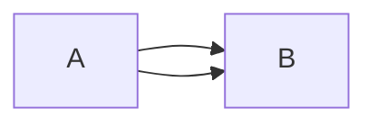

# Test File


This is some text to add to the buffer

This is a test snippet 
```lua
local foo = bar()
function foober()
    return foo
end
```

This is a file to test `peek.nvim`

this should show up dynamically and it is very cool

List of stuff:
* first thing
* Second thing
    * nested thing

This is a diagram to test mermaid:



